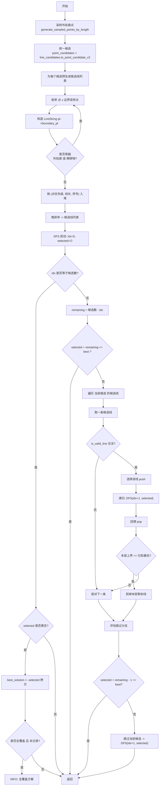

# 编号排布-软件设计

## 一、总体目标

开发一款工程图编号标注自动排布软件, 用于生成从部件点或线段到多边形边界的一组引出线段, 确保编号在视图中的位置合理、均匀分布且不与障碍物(如标高线、文字框)发生碰撞, 同时满足几何和拓扑约束, 优化线段长度和布局美观性。

## 二、核心功能需求

1. **输入数据处理**
   - 接收 JSON 格式的输入数据, 包括：
     - 多边形包围盒边缘(闭合多边形路径)。
     - 部件编号信息(点候选集合 `PartPointCandidate` 和线候选集合 `PartLineCandidate`, 包含可能的起始点或线段)。
     - 矩形障碍物集合 `ObstacleBox`。
     - 线段障碍物集合 `BarrierLine`(如标高线与定位线)。
   - 解析输入数据为适合几何运算的结构(如 `Point`、`LineString`、`Polygon`), 验证输入合法性(如检查缺失字段、点集是否构成有效多边形)。
   - 将线候选转换为点候选(通过固定步长采样线段), 统一为点候选进行后续处理。

2. **终点线生成与筛选**
   - 根据多边形边界生成候选终点集合, 通过固定步长(或动态调整步长)均匀采样边界点。
   - 为每个点候选(或从线候选转换的点)计算与边界采样点的连接线, 筛选满足以下条件的候选线段：
     - 不穿越多边形边界(从内部连出)。
     - 不穿越任何矩形障碍物。
     - 与线段障碍物保持指定距离(默认 5mm)。
     - 终点集合相互远离一定距离(默认 5mm)。
     - 线段与多边形外包围盒法线的夹角在5°到65°之间。
     - 线段不得水平(与水平线夹角 ≠ 0°)或竖直(与垂直线夹角 ≠ 0°)。

3. **编号排布**
   - **贪心策略**：
     - 为每个点候选选择最短且满足约束的线段(不与已有线段相交、不穿越障碍物、远离线段障碍物、满足夹角和非水平/竖直约束)。
     - 逐一确定每个候选的引出线, 更新已使用线段集合以避免后续交叉。
   - **回溯策略**：
     - 若贪心策略无法为所有候选生成有效线段, 采用回溯算法, 尝试不同线段组合以最大化成功连接的候选数量。
     - 递归探索所有可能线段, 记录全局最优解(连接最多候选的方案)。
   - 若某些候选无法连接, 跳过并继续处理其他候选。

4. **布局优化**
   - 在初始排布基础上, 通过动态调整步长优化线段布局, 减少重叠并提高均匀性。
   - 使用二分法调整采样步长(建议基于多边形周长动态调整, 如周长的 1/100), 记录每轮的最佳结果。
   - 优化线段夹角分布, 确保夹角均匀分布于5°到65°, 避免过于集中。

5. **排布结果量化**
   - 评估引出线段的布局质量, 基于以下指标：
     - 线段终点在边界上的分布均匀程度(以终点间距离标准差衡量)。
     - 线段长度优化程度(优先选择较短线段)。
     - 与线段障碍物的距离(避免靠近以提升美观性)。
     - 线段夹角的合规性(5°到65°)和分布均匀性。
   - 计算每条边界线的量化得分, 按候选数量加权平均, 得出整体布局评分。

## 三、数据结构需求

- **输入数据**(基于 JSON 格式)：
  - 多边形边界(`target_exterior`)：点集描述的闭合多边形(`shapely.Polygon`)。
  - 部件编号信息：
    - 点候选(`PartPointCandidate`)：包含部件名称和点集(`shapely.Point`)。
    - 线候选(`PartLineCandidate`)：包含部件名称和线段集(`MyLine`), 可转换为点候选。
  - 障碍物信息：
    - 矩形障碍物(`ObstacleBox`)：由四个顶点构成的矩形(`shapely.Polygon`)。
    - 线段障碍物(`BarrierLine`)：线段集合(`MyLine`), 用于避免靠近。

## 四、约束与要求

- **几何约束**：
  - 引出线段起点为部件点候选或线候选的采样点, 终点位于多边形边界。
  - 线段不得穿越多边形边界(仅从内部连出)。
  - 线段不得穿越矩形障碍物。
  - 线段终点与线段障碍物保持最小距离(默认 5mm)。
  - 线段与多边形外包围盒法线的夹角在5°到65°之间。
  - 线段不得水平(与水平线夹角 ≠ 0°)或竖直(与垂直线夹角 ≠ 0°)。
- **拓扑约束**：
  - 所有引出线段互不相交。
- **优化目标**：
  - 尽量缩短每条引出线段的长度。
  - 确保终点在边界上分布均匀。
  - 确保线段夹角均匀分布于5°到65°。
  - 提高布局美观性(通过与线段障碍物保持距离)。
- **健壮性**：
  - 验证输入数据的合法性(如点集是否构成有效多边形、是否存在缺失字段)。
  - 处理非法输入, 抛出 `SchemaParseError` 异常。

## 五、测试需求

- **功能测试**：验证软件是否满足所有几何和拓扑约束, 包括夹角(5°到65°)和非水平/竖直约束, 覆盖所有合法输入场景。
- **边界测试**：测试边界值(如最小/最大采样步长、点集数量、边界点密度、夹角边界值5°和65°)。
- **异常处理测试**：验证软件在非法输入(如缺失字段、无效多边形)下的异常处理能力。

## 六、接口与集成

- 提供命令行接口, 支持输入文件解析与完整生成流程。
- 输入输出数据结构与 JSON 格式兼容, 方便与外部系统(如 `C#` 程序)集成。
- 使用 `CLR`(Common Language Runtime)封装成 `C#` 可以调用的形式。

## 七、技术栈

- **语言**：Python 3.13.6
- **几何运算**：
  - `shapely`：处理点、线、多边形及其几何操作(交集、距离计算、夹角计算等)。
  - `numpy`：支持高效数组和向量计算。
- **数据结构**：
  - `heapq`：实现最小堆, 用于按线段长度排序。
- **可视化**：
  - `matplotlib`：用于绘制几何图形和验证算法效果(包括夹角分布)。
- **开发环境**：
  - 使用虚拟环境(`python -m venv`)隔离依赖。
  - 通过 `pip install -r requirements-dev.txt` 安装依赖。

## 八、其他

- 软件支持单视图处理(三视图、展开图或向视图), 每次处理一个视图的编号排布。
- 采样步长动态调整, 建议基于多边形周长(如周长的 1/100)。
- 线候选采样规则：
  - 短线段视为单点(仅取中点)。
  - 中等长度线段按固定步长采样。
  - 长线段按固定数量采样。
- 优化建议：
  - 按几何中心到边界的距离对候选排序以提高效率。
  - 使用向量运算验证线段夹角, 优先选择满足5°到65°约束的线段。
  - 在回溯算法中优先探索夹角分布均匀的方案。

## 九、回溯排布算法流程（generate_connection_lines_from_point_candidates_backtracking）

下图与步骤描述展示了回溯版排布算法的整体流程，已包含“优先级”策略：

- 候选优先级说明：`priority` 从 1 开始，数值越小优先级越高；数值越大优先级越低。
- 候选排序规则：按“候选内点的最小 priority”升序排序（高优先更先处理）。
- 候选内连线排序：以“点的 priority”优先，再以“线段长度”优先（更小更优）。

### 步骤概览

1) 边界采样：对外轮廓 `exterior` 以固定步长采样边界点集合。
2) 候选统一：将线候选 `PartLineCandidate` 通过 v2 规则采样为点候选，与原有点候选合并。
3) 候选排序（按优先级）：对合并后的候选按最小点优先级升序排序。
4) 预生成可行连线：
   - 对每个候选，枚举其每个点与全部边界采样点，构造连线；
   - 过滤不合法连线（不穿越外轮廓、不穿越障碍物的快速几何筛选）；
   - 将合格连线按键 `(点priority, 线长)` 排序，得到该候选的“候选线列表”。
5) 回溯搜索（DFS）与剪枝：

- 递归遍历候选序列，尝试为当前候选选择一条与既有选择不冲突的连线；
- 使用 `is_valid_line` 严格校验（不与已有连线相交、满足距离/夹角等约束、避开驱散线 `dispel_lines`）；
- 维护全局最优（连接数量最多）。
- 入口剪枝：若“当前已选数量 + 剩余候选数 ≤ 已知最优条数”，直接回退。
- 循环层剪枝：在当前候选的候选线循环中，若“本层上界 = 当前已选 + 剩余候选数 == 已知最优”，剪掉本层剩余线的尝试。
- 跳过分支剪枝：若“当前已选 + 剩余候选数 - 1 ≤ 已知最优”，则无需探索“跳过当前候选”的分支。

6）日志记录

- 当找到“全覆盖”（全部候选均成功连接）时，输出一次 INFO 日志（控制台可见）。
- DFS 过程细节（进入、剪枝、尝试、选择、回溯、跳过、更新最优）以 DEBUG 写入 `backtracking_dfs.log` 文件。

### Mermaid 流程图

### 伪代码（与实现一致）

- 输入：
  - `point_candidates: list[PartPointCandidate]`
  - `line_candidates: list[PartLineCandidate]`
  - `exterior: Polygon`, `obstacles: list[Polygon]`, `dispel_lines: list[LineString]`
  - `samples_distance: int`

- 输出：
  - `list[LineString]`（最佳方案中的连线集合）

- 核心逻辑：
  - 采样 `exterior` 的边界点。
  - 将线候选转点候选（v2），与点候选合并，按候选优先级排序。
  - 为每个候选生成“候选线列表”，按 `(点priority, 线长)` 排序。
  - DFS：按顺序尝试为每个候选选线，满足 `is_valid_line` 则继续；维护 `best_solution`，并应用三类剪枝（入口剪枝、循环层剪枝、跳过分支剪枝）。
  - 日志：全覆盖以 INFO 输出到控制台；DFS 细节以 DEBUG 写入 `backtracking_dfs.log`；最终返回 `best_solution`。

提示：优先级越小越先被处理；在候选内部也优先使用来自高优先级点的连线，并倾向更短的连线，这会引导回溯更早满足高优先级部件的布线需求。
